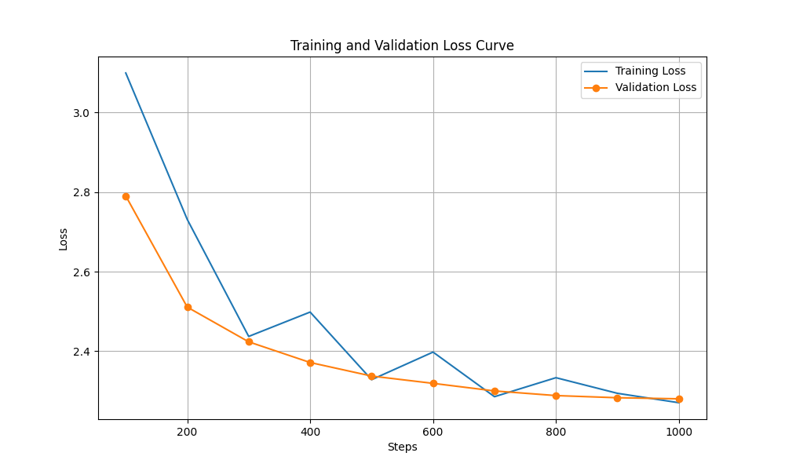

# 🚀 GPT-Neo 1.3B Fine-Tuning for Q&A

This project provides a complete workflow for fine-tuning the `EleutherAI/gpt-neo-1.3B` model on a custom question-and-answer dataset. It leverages parameter-efficient fine-tuning (PEFT) with LoRA and includes scripts for training, evaluation, and visualization.

## 📋 Table of Contents

1.  [✨ Project Overview](#-project-overview)
2.  [📂 File Structure](#-file-structure)
3.  [🛠️ Setup and Installation](#️-setup-and-installation)
4.  [💾 Dataset](#-dataset)
5.  [🤖 Model Fine-Tuning](#-model-fine-tuning)
6.  [📈 Evaluation and Results](#-evaluation-and-results)
7.  [🚀 How to Run the Scripts](#-how-to-run-the-scripts)

---

## ✨ Project Overview

The primary goal of this project is to adapt a large language model (LLM) to a specific domain by fine-tuning it on a custom Q&A dataset. This process enhances the model's ability to generate relevant and accurate answers for domain-specific queries.

**Key Features:**
-   **Parameter-Efficient Fine-Tuning (PEFT)**: Uses LoRA to fine-tune the model efficiently, requiring less computational resources than full fine-tuning.
-   **Robust Evaluation**: The dataset is split into training, validation, and test sets to prevent overfitting and provide an unbiased assessment of the model's performance.
-   **Comprehensive Workflow**: Includes scripts for every step of the process, from data preparation to training, inference, and plotting results.
-   **Clear Visualization**: Generates a loss curve plot to visualize the model's learning progress.

---

## 📂 File Structure

Here is an overview of the project's file structure:

```
.
├── 📄 README.md
├── 📋 requirements.txt
├── 📁 data/
│   └── extracted_qna.jsonl
├── 📁 scripts/
│   ├── 1️⃣ gpt-neo_model.py   # Initial script to load the model
│   ├── 2️⃣ fine_tune.py       # Main script for fine-tuning
│   ├── 3️⃣ inference.py       # Script for running inference
│   ├── 4️⃣ plot_loss.py       # Script to plot the loss curve
│   └── 5️⃣ evaluate.py        # Script to evaluate the model on the test set
├── 🖼️ loss_curve.png
└──  результаты/
    └── ... (checkpoints and logs)
```

---

## 🛠️ Setup and Installation

1.  **Clone the repository:**
    ```bash
    git clone <your-repo-url>
    cd <your-repo-name>
    ```

2.  **Create and activate a virtual environment (recommended):**
    ```bash
    python3 -m venv .venv
    source .venv/bin/activate
    ```

3.  **Install the required dependencies:**
    ```bash
    pip install -r requirements.txt
    ```

---

## 💾 Dataset

The dataset, located at `data/extracted_qna.jsonl`, is a JSON Lines file where each line represents a Q&A pair:
```json
{"question": "What is the primary purpose of the DPIP Edge Service?", "answer": "The primary purpose is to enable ultra-low-latency, real-time fraud screening..."}
```
The `fine_tune.py` script automatically splits this data into:
-   **Training Set (80%)**: For training the model.
-   **Validation Set (10%)**: For periodic evaluation during training to prevent overfitting.
-   **Test Set (10%)**: For a final, unbiased evaluation of the trained model.

---

## 🤖 Model Fine-Tuning

The fine-tuning process is handled by `scripts/fine_tune.py`. Here’s a summary of the approach:

-   **Model**: `EleutherAI/gpt-neo-1.3B`.
-   **Technique**: LoRA (Low-Rank Adaptation) from the `peft` library.
-   **Training Arguments**:
    -   **Epochs**: 5
    -   **Batch Size**: 4
    -   **Evaluation**: Performed every 100 steps on the validation set.
    -   **Checkpointing**: Saves the model every 100 steps and keeps the best model based on validation loss (`load_best_model_at_end=True`).

---

## 📈 Evaluation and Results

-   **Quantitative**: The `scripts/evaluate.py` script computes the test loss and perplexity on the hold-out test set.
    -   **Test Loss**: 2.2940
    -   **Perplexity**: 9.9142
-   **Qualitative**: The script also generates sample answers for questions from the test set to allow for a manual review of the model's performance.
-   **Visualization**: The `scripts/plot_loss.py` script generates a plot of the training and validation loss curves, saved as `loss_curve.png`.



---

## 🚀 How to Run the Scripts

1.  **Fine-Tune the Model**:
    This script will train the model on the `data/extracted_qna.jsonl` dataset and save the best-performing adapters to the `fine-tuned-gpt-neo` directory.
    ```bash
    python3 scripts/fine_tune.py
    ```

2.  **Evaluate the Model**:
    This script evaluates the fine-tuned model on the test set and prints a summary of the results.
    ```bash
    python3 scripts/evaluate.py
    ```

3.  **Generate the Loss Plot**:
    After training is complete, run this script to generate the `loss_curve.png` image.
    ```bash
    python3 scripts/plot_loss.py
    ```

4.  **Run Inference**:
    To test the model with a single prompt, you can use the inference script.
    ```bash
    python3 scripts/inference.py
