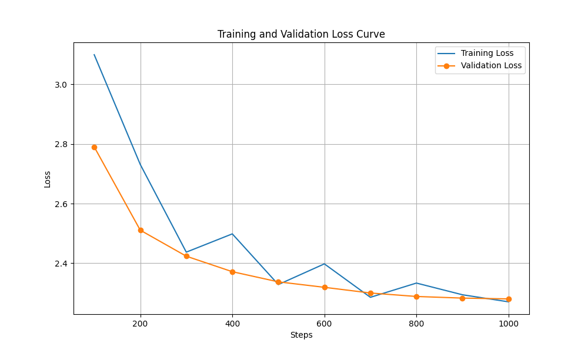
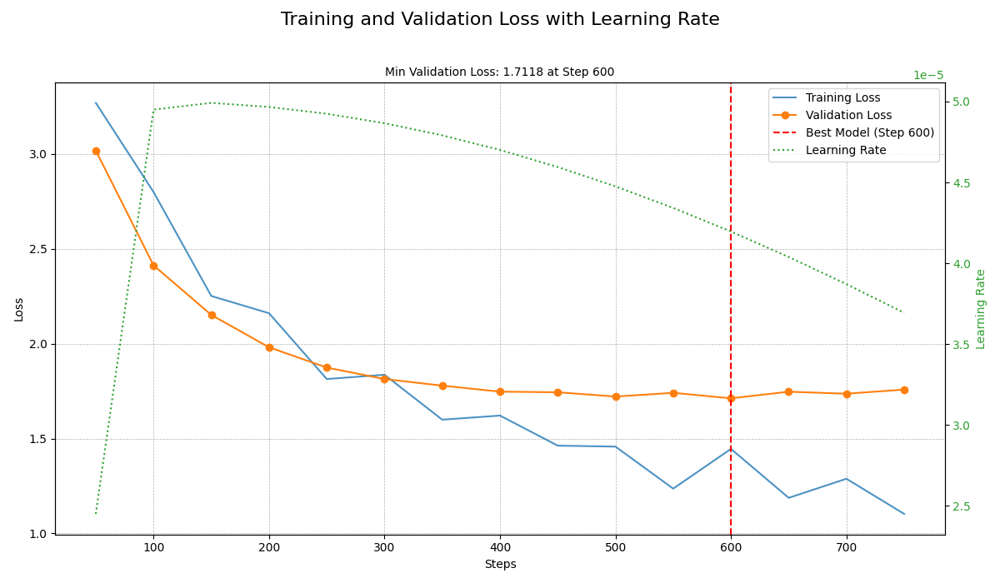

# 🚀 GPT-Neo 1.3B Fine-Tuning for Q&A

This project provides a complete, automated workflow for fine-tuning the `EleutherAI/gpt-neo-1.3B` model on a custom question-and-answer dataset. It leverages parameter-efficient fine-tuning (PEFT) with LoRA and includes scripts for training, evaluation, and visualization, all orchestrated with a `Makefile`.

## 📋 Table of Contents

1.  [✨ Project Overview](#-project-overview)
2.  [📂 File Structure](#-file-structure)
3.  [🛠️ Setup and Installation](#️-setup-and-installation)
4.  [🤖 Automated Workflow with Makefile](#-automated-workflow-with-makefile)
5.  [💾 Dataset](#-dataset)
6.  [📈 Evaluation and Results](#-evaluation-and-results)
7.  [🚀 How to Run the Scripts](#-how-to-run-the-scripts)

---

## ✨ Project Overview

The primary goal of this project is to adapt a large language model (LLM) to a specific domain(here fintech sector) by fine-tuning it on a custom Q&A dataset. This process enhances the model's ability to generate relevant and accurate answers for domain-specific queries.

**Key Features:**
-   **Automated Pipeline**: A `Makefile` automates the entire workflow, from data preparation to training and evaluation.
-   **Parameter-Efficient Fine-Tuning (PEFT)**: Uses LoRA to fine-tune the model efficiently.
-   **Robust Evaluation**: The dataset is split into training, validation, and test sets. The model is evaluated for loss, perplexity, and BLEU score.
-   **Overfitting Prevention**: Implements Early Stopping to ensure the model is saved at its peak performance.
-   **Comprehensive Workflow**: Includes scripts for every step of the process.
-   **Clear Visualization**: Generates a detailed loss curve plot with learning rate and the best model checkpoint.

---

## 📂 File Structure

Here is a detailed overview of the project's file structure:

```
.
├── 📄 README.md                # This file, providing an overview of the project.
├── 📋 requirements.txt          # A list of all Python packages required to run the project.
├── 📜 Makefile                  # Automates the workflow with commands like `make all` and `make clean`.
│
├── 📁 data/
│   ├── qa_dataset.jsonl       # The original, raw dataset.
│   ├── train.jsonl            # (Generated) The training set.
│   ├── validation.jsonl       # (Generated) The validation set.
│   └── test.jsonl             # (Generated) The test set.
│
├── 📁 scripts/
│   ├── prepare_dataset.py     # Splits the raw dataset into train, validation, and test sets.
│   ├── fine_tune.py           # The main script for fine-tuning the model.
│   ├── evaluate.py            # Evaluates the fine-tuned model and generates a detailed report.
│   ├── plot_loss.py           # Generates a plot of the training and validation loss curves.
│   └── inference.py           # A simple script to run inference with the fine-tuned model.
│
├── 🖼️ loss_curve.png             # (Generated) The output plot of the loss curves.
│
├── 📁 eval_results/
│   └── eval_results.json      # (Generated) A JSON file containing the detailed evaluation results.
│
└── 📁 results/
    └── ...                    # (Generated) Checkpoints and logs from the training process.
```
---

## 🛠️ Setup and Installation

1.  **Clone the repository:**
    ```bash
    git clone https://github.com/kurai-sx/sft-play.git
    cd sft-play
    ```

2.  **Create and activate a virtual environment (recommended):**
    ```bash
    python3 -m venv .venv
    source .venv/bin/activate
    ```

3.  **Install the required dependencies:**
    ```bash
    pip install -r requirements.txt
    ```

---

## 💾 Dataset
The dataset, located at `data/qa_dataset.jsonl`, is a JSON Lines file where each line represents a Q&A pair:
```json
{"question": "What is the primary purpose of the ...?", "answer": "The primary purpose is to enable ultra-low-latency, real-time fraud screening..."}
```
The `fine_tune.py` script automatically splits this data into:
-   **Training Set (80%)**: For training the model.
-   **Validation Set (10%)**: For periodic evaluation during training to prevent overfitting.
-   **Test Set (10%)**: For a final, unbiased evaluation of the trained model.

---

## 🤖 Model Fine-Tuning

The fine-tuning process is handled by `scripts/fine_tune.py`. Here’s a summary of the approach:

-   **Model**: `EleutherAI/gpt-neo-1.3B`.
-   **Technique**: LoRA (Low-Rank Adaptation) from the `peft` library.
-   **Training Arguments**:
    -   **Epochs**: 20
    -   **Batch Size**: 4
    -   **Evaluation**: Performed every 100 steps on the validation set.
    -   **Checkpointing**: Saves the model every 100 steps and keeps the best model based on validation loss (`load_best_model_at_end=True`).

---

## 📈 Evaluation and Results

-   **Quantitative**: The `scripts/evaluate.py` script computes the test loss and perplexity on the hold-out test set.
-   **Test Loss**: 1.9101
-   **Perplexity**: 6.7536
-   **Qualitative**: The script also generates sample answers for questions from the test set to allow for a manual review of the model's performance.
-   **Visualization**: The `scripts/plot_loss.py` script generates a plot of the training and validation loss curves, saved as `loss_curve.png`.

### Version 1: Initial Training Run

The first training run (v1) showed signs of overfitting, where the validation loss started to increase while the training loss continued to decrease.



### Version 2: Improved Training Run

After implementing a more robust training strategy (v2) with early stopping and better hyperparameters, the new loss curve shows a much healthier trend, with the validation loss closely tracking the training loss.



---

## 🚀 How to Run the Scripts

This project uses a `Makefile` to automate the entire workflow. You can either run the full pipeline with a single command or execute each step individually.
---

## 🏁 Conclusion and Future Work

This project successfully demonstrates a robust and automated workflow for fine-tuning a GPT-Neo model on a custom dataset. By leveraging techniques like LoRA, early stopping, and a validation set, we were able to significantly improve the model's performance and prevent overfitting.

**Future Work:**
-   **Hyperparameter Tuning**: Experiment with different learning rates, batch sizes, and LoRA configurations to further optimize performance.
-   **Larger Dataset**: A larger and more diverse dataset would likely lead to better generalization and more accurate answers.
-   **Different Models**: This workflow could be adapted to fine-tune other models from the Hugging Face Hub.

### 🌟 Option 1: Run the Full Pipeline (Recommended)

This is the easiest way to get started. This single command will execute all the necessary steps in the correct order: data preparation, training, evaluation, and plotting.

```bash
make all
```

### 🛠️ Option 2: Run Each Step Manually

If you want more control over the process, you can run each step individually.

#### 1. Prepare the Dataset
This command splits the original `data/qa_dataset.jsonl` into `train.jsonl`, `validation.jsonl`, and `test.jsonl`.

```bash
make prepare-dataset
```

#### 2. Train the Model
This command starts the fine-tuning process. The script will use the prepared datasets and save the best model based on validation performance.

```bash
make train
```

#### 3. Evaluate the Model
After training is complete, this command evaluates the best model on the unseen test set and saves a detailed report to `eval_results/eval_results.json`.

```bash
make evaluate
```

#### 4. Plot the Loss Curve
This command generates the `loss_curve.png` image from the latest training logs, allowing you to visualize the training and validation loss.

```bash
make plot
```

### 🧪 Manual Inference
To test the model with a single, hardcoded prompt, you can use the `inference` command. This is useful for a quick qualitative check.

```bash
make inference
```

### 🧹 Cleaning Up
To remove all generated files (split datasets, results, logs, and plots), you can run:
```bash
make clean
```

---

## 📜 License

This project is licensed under the MIT License. See the [LICENSE](LICENSE) file for details.

**Authored by:** Suraj Nagre
